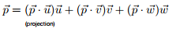
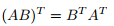
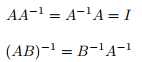
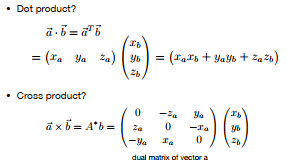

# 向量
- 向量表示
- 单位向量
- 加法（平行四边形法、三角形法）
## 向量乘法
### 点乘
- 交换律、结合律
- 求两个向量的夹角
- 求向量投影
- 判断两个向量方向的1~0~-1逐渐远离
### 叉乘
- 判断一个向量在另一个向量的左还是右（右手系和左手系有不同）
判读一个点是否在三角形的里面
- 任意向量投影到坐标系：

# 矩阵
- 乘法（需要第几行几列就找几行几列的点积）
- 转置矩阵
- 单位矩阵和逆矩阵
- 向量乘积的矩阵形式
